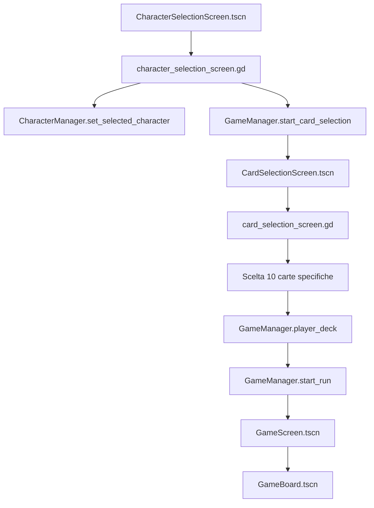
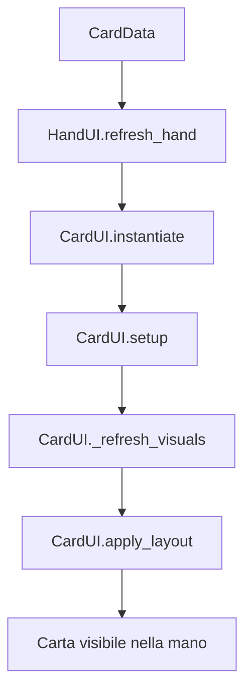
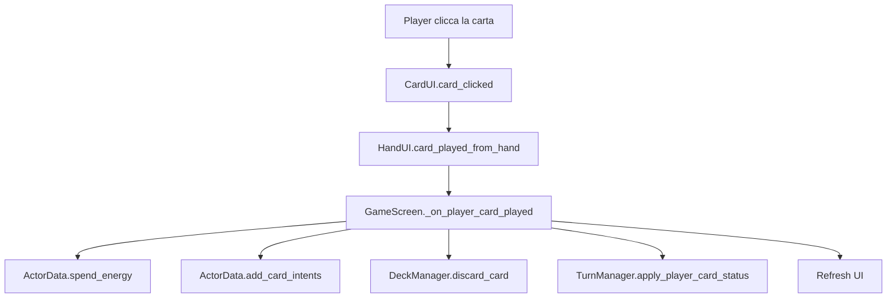
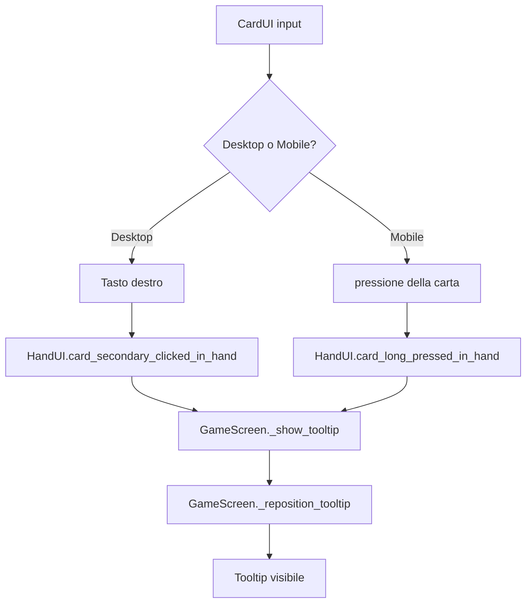
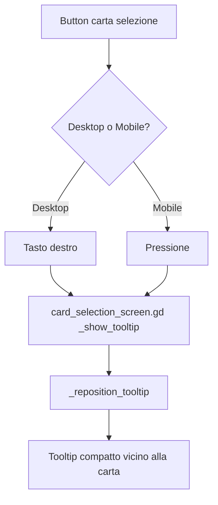
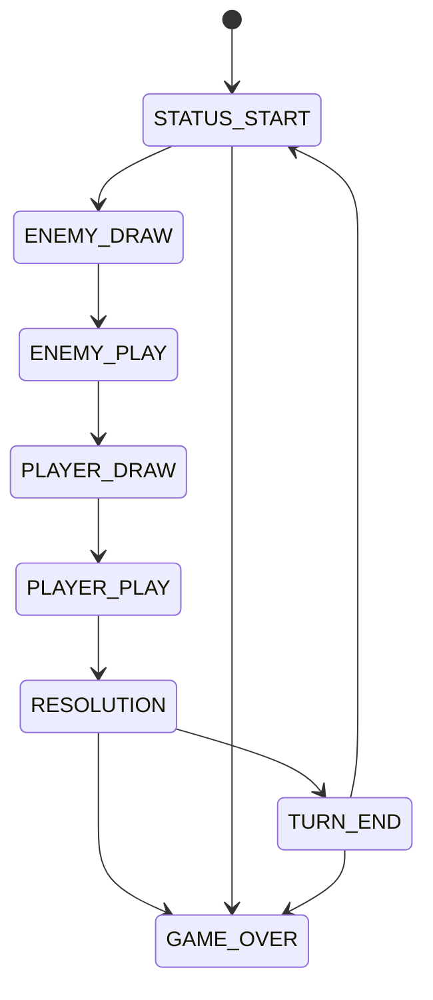
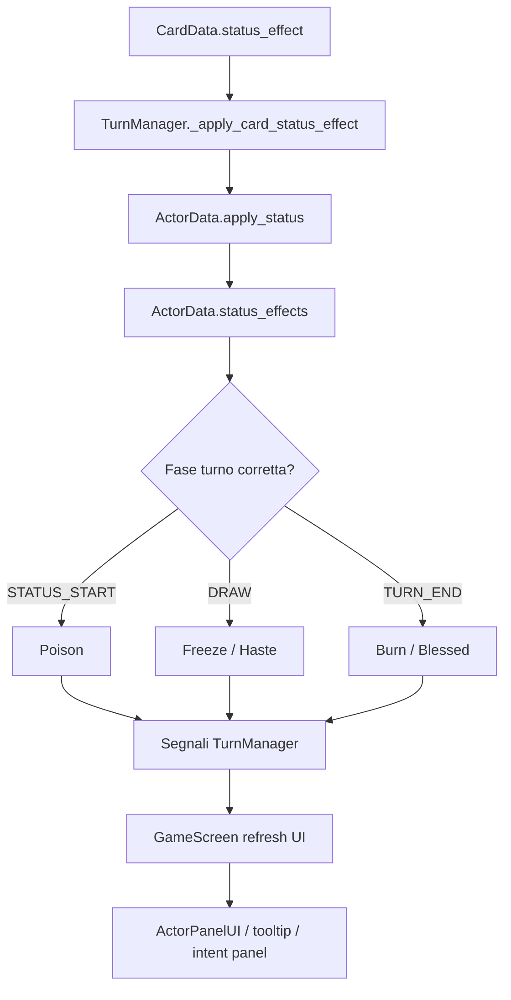
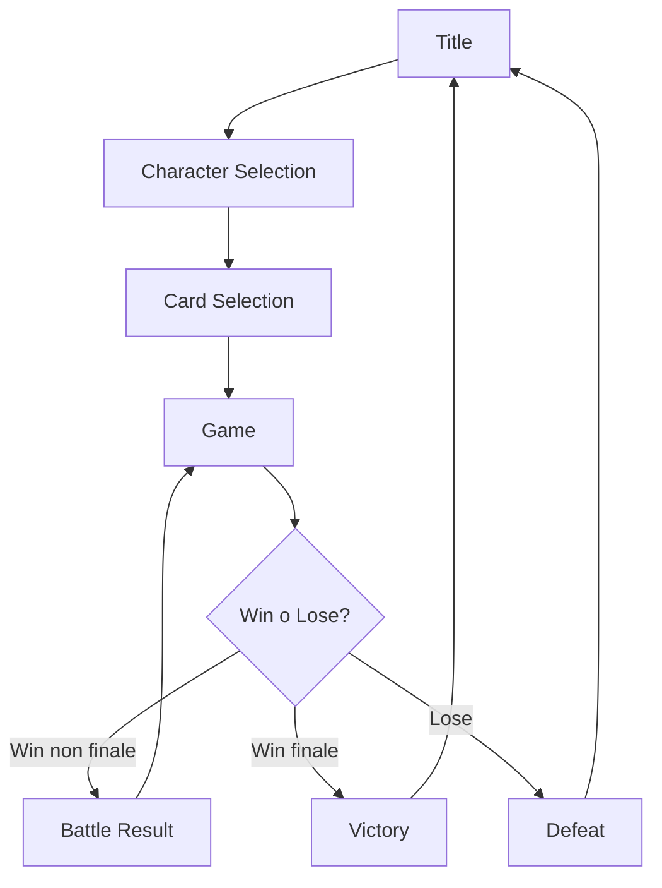

# Diagrammi dei flussi UI e gameplay

Questa guida raccoglie diagrammi di flusso per capire velocemente come si muovono dati e interazioni nel progetto.

## 1. Flusso selezione personaggio -> selezione carte -> run

## 2. Flusso di una carta in combattimento

## 3. Flusso click carta player

## 4. Flusso tooltip combattimento desktop/mobile

## 5. Flusso tooltip selezione carte

## 6. Flusso turni del combattimento

## 7. Flusso status effect

## 8. Flusso scene della run

## 9. Come usare questi diagrammi

Se non sai dove intervenire:

1. individua il flusso che somiglia al problema
2. segui i file da sinistra a destra
3. decidi se il problema e di:
   - dati
   - layout scena
   - resize runtime
   - input/tooltip
   - logica turni/status

Questa guida non sostituisce i riferimenti file-per-file, ma ti aiuta a capire la direzione giusta prima di editare.